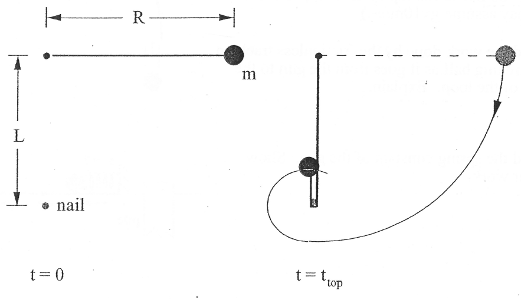

# AP-Physics-C-Final-Project

By Daniel and Ian

This is a simulation of a pendulum consisting of a mass tied to a pivot via a rope of negligible mass. 
There is a second pivot below that first pivot that the rope will swing around once it contacts the second pivot.

The user can change the following:
- The length of the rope
- The distance between the two pivots
- The radius of the second pivot
- The initial angle
- The initial angular velocity

Since the point of the simulation is to show what happens when the block wraps around the second pivot,
if the rope is too short (its not long enough to reach the second pivot),
the simulation will tell the user that the rope is too short
and the user will have the opportunity to change the initial values and start the simulation again

The start button, well, starts the simulation...
The reset button, resets the simulation... duh

